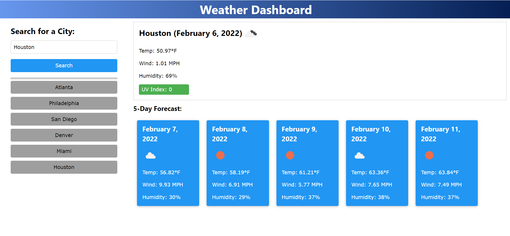

# :calendar: :partly_sunny::Server Side APIs: Weather Dashboard Challenge :partly_sunny: :calendar:

## Overview :book:
For this challenge I was assigned to build a weather dashboard that will run in the browser and feature dynamically updated HTML and CSS.  Utilizing a Server Side Application Programming Interface (API), [OpenWeather One Call API](https://openweathermap.org/api/one-call-api), to retrieve weather data for cities and using localStorage to store any persistent data.


### User Story :notebook_with_decorative_cover:
```
AS A traveler
I WANT to see the weather outlook for multiple cities
SO THAT I can plan a trip accordingly
```

### Client's Acceptance Criteria :pencil2:
```
GIVEN a weather dashboard with form inputs
WHEN I search for a city
THEN I am presented with current and future conditions for that city and that city is added to the search history
WHEN I view current weather conditions for that city
THEN I am presented with the city name, the date, an icon representation of weather conditions, the temperature, the humidity, the wind speed, and the UV index
WHEN I view the UV index
THEN I am presented with a color that indicates whether the conditions are favorable, moderate, or severe
WHEN I view future weather conditions for that city
THEN I am presented with a 5-day forecast that displays the date, an icon representation of weather conditions, the temperature, the wind speed, and the humidity
WHEN I click on a city in the search history
THEN I am again presented with current and future conditions for that city
```

---
## Features

* Dynamically updated HTML
* CSS
* Javascript
* JSON
* Moment library
* OpenWeather One Call API
* DOM

---

## :link: Link to Webpage

Click the following link to visit the webpage:

[A live link to the webpage](https://adorsey5.github.io/work-day-scheduler/)


The following image is a screenshot of the webpage:



---
## :capital_abcd:Languages and Technology Used :computer:

### Languages
* HTML
* CSS
* Javascript


### Technology

* VSCode
* GitBash
* Emojis from "Markdown Emoji" VSCode extension *

---

## Acknowledgments

For my fourth challenge I had a great deal of guidance from:

 * UM Coding Bootcamp Modules/GitLab Respository
 * UM Coding Bootcamp instructor and teacher assistants (TAs)
 * UM Coding Bootcamp Tutor: Jeremy Jones
 * UM Coding Bootcamp Classmates
 * Stackoverflow
 * Google
 * YouTube


 ---

- - -
© 2022 Asha Dorsey
